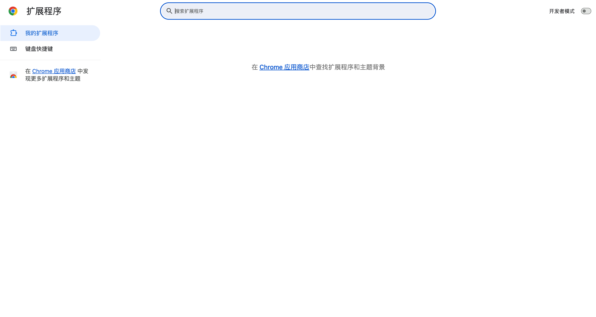
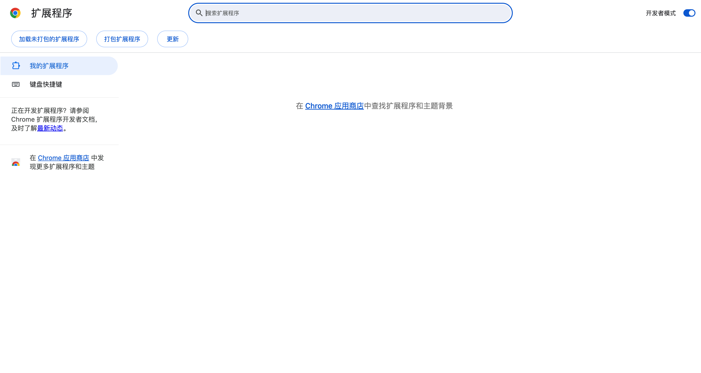
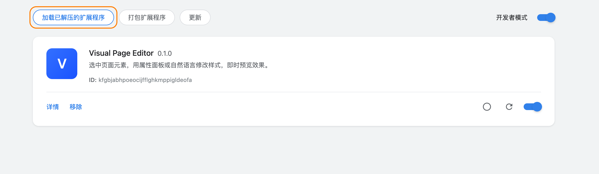
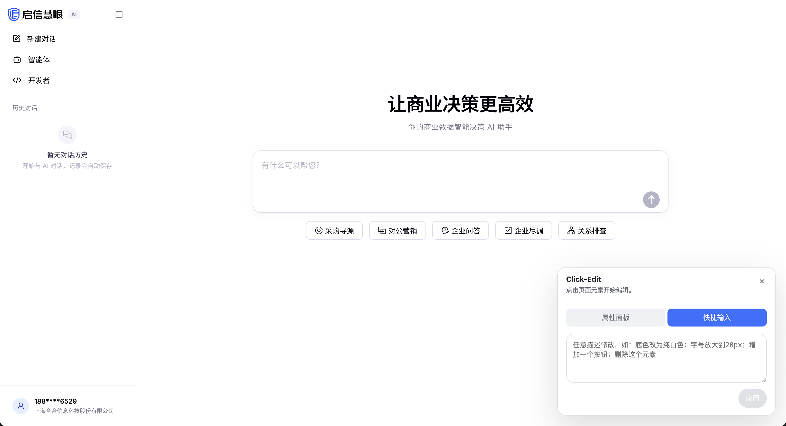
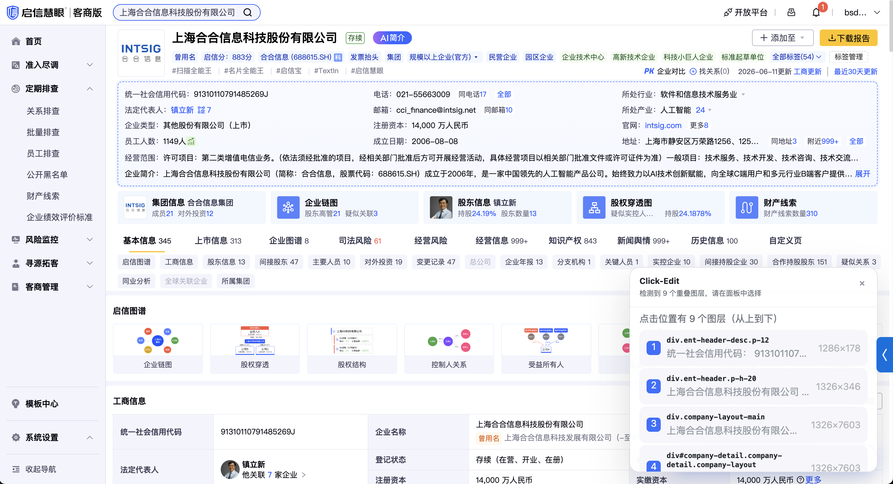

# Click-Edit 使用说明

一句话介绍：在任意网页上**点选元素 → 用属性面板或一句中文 → 即时改样式/文案**，刷新不丢，可导出。

适用场景：

- 评审/沟通时，直接在线上页面或本地 demo 上改给对方看，不用拉前端
- 设计走查、UI 微调（颜色、间距、圆角、字号、隐藏、复制元素…）
- 本地 HTML 静态文件的可视化微调

---

## 一、安装（首次只做一次）

> 本插件**未上架 Chrome 商店**，需要用「开发者模式」加载本地文件夹。

### 1. 拿到插件文件夹

把 `extension` 这个文件夹整个拷到你电脑任意位置（推荐桌面或 `~/Documents`）。

⚠️ 注意：**不要放在 iCloud 同步目录里**，否则文件可能被云端"驱逐"导致插件加载失败。如果你拿到的是 zip，先解压。

### 2. 打开 Chrome 扩展页

地址栏粘贴：`chrome://extensions/` 回车。

（Edge 浏览器同样支持，地址：`edge://extensions/`）



### 3. 打开开发者模式

页面**右上角**有一个「开发者模式」开关，打开它。

打开后，左上方会出现「加载已解压的扩展程序 / 打包扩展程序 / 更新」三个按钮：



### 4. 加载插件

点左上角「**加载已解压的扩展程序**」，选刚才那个 `extension` 文件夹（注意是文件夹本身，不是里面的 `manifest.json`）。

加载成功后会出现一个名为 **Click-Edit** 的卡片，旁边有插件图标：



### 5. 固定到工具栏（推荐）

点 Chrome 右上角的拼图图标 🧩 → 找到 Click-Edit → 点旁边的图钉，把它固定到工具栏。

---

## 二、使用

### 1. 启用编辑器

打开你想改的网页 → 点工具栏上的 Click-Edit 图标 → 点「**启用编辑器**」。


页面右下角会出现一个浮层面板：



> 同一个标签页刷新后会**自动重新启用**；切到新标签页需要手动重新启用一次。

### 2. 选中元素

把鼠标移到页面上，会有蓝色虚线高亮，**点一下**就选中。

如果点击位置有多个重叠图层，浮层会列出所有候选，按「最上层 → 最外层」排序，点一下数字就能锁定要改的那一层：



### 3. 改它

面板有两个 Tab：

#### 🅐 属性面板（精确控制）

- 颜色、背景、字号、字重、圆角、间距、阴影… 直接拖/输入数值
- 适合：你清楚要改成什么数值

#### 🅑 快捷输入（自然语言，推荐）

输入框里直接打中文，例：

| 你输入                       | 效果                       |
| ---------------------------- | -------------------------- |
| `底色改为纯白色`             | 背景色 → #fff              |
| `字号放大到 20px`            | font-size: 20px            |
| `文字颜色改成蓝色`           | color: #3370ff             |
| `加一个磨砂半透明背景`       | 毛玻璃效果（含 backdrop-filter） |
| `磨砂半透明，但不要阴影`     | 同上但去掉 shadow          |
| `高度适配网页高度`           | height: 100vh              |
| `删除阴影` / `去掉边框`      | 移除对应样式               |
| `文案改成"立即体验"`         | 替换文本                   |
| `删除这个元素`               | 隐藏元素                   |
| `复制一个`                   | 在旁边克隆一个同款         |
| `往上移` / `往下移` / `置顶` | 调整在父容器里的顺序       |

支持的颜色关键词：蓝/绿/红/橙/紫/黑/白/灰/浅蓝/浅灰/纯白/纯黑，也可以直接写 `#1A53FF`。

> 一句话里可以混合多个意图，比如：`底色蓝色，字白色，圆角 12px`。

### 4. 保留你的修改

- 修改自动写入当前页面的 `localStorage`
- **同一个标签页刷新页面，修改会自动重新应用**
- 关掉浏览器再打开，只要还在同一个域，修改也还在

### 5. 撤销 / 回退 / 重置

面板底部有最近 5 条修改记录：

- **回退**：从最新记录倒序撤到这条记录之前（适合一次撤掉一连串试错）
- **重置**：清空当前页面所有修改并刷新页面
- **导出**：把所有修改导出成 `visual-edits.json`，可以发给前端同学，或者用 CLI 转成代码 patch

### 6. 停用编辑器

再点一下浏览器工具栏的插件图标 → 「停用编辑器」。已应用的修改不会被清除（除非点重置）。

---

## 三、常见问题

**Q：插件加载报错「Manifest file is missing or unreadable」**
A：确认你选的是 `extension` 文件夹本身，里面要有 `manifest.json`。如果文件夹是从 iCloud 同步过来的，可能有几个 png 还没下载下来，先把整个文件夹下到本地（图标 ☁️ 变成实心）再加载。

**Q：点了图标没反应 / 不出现编辑面板**
A：

1. 当前页是不是 `chrome://`、`chrome-extension://` 这类受限页面？这些页 Chrome 不允许任何插件注入，换一个普通 https 页面试。
2. 看面板状态文字，如果显示报错把文字截图发我。

**Q：刷新后样式丢了**
A：自动恢复依赖 `localStorage`，如果你开了**无痕模式**或站点禁用了 localStorage 就会丢。在普通窗口里就没事。

**Q：能改任何网站吗？**
A：能，包括公司内网、生产环境（比如 b.qixin.com）。但**改动只在你自己浏览器里**，别人看到的还是原版。

**Q：怎么把改好的样子给同事看？**

- 同电脑同浏览器：他打开同样的 URL，刷新就能看到（localStorage 共享）
- 不同电脑：导出 `visual-edits.json` 发给他，他在同一个页面点导入；或截图/录屏

**Q：能直接改源代码吗？**
A：可以，但需要**进阶用法**（见下文 save-server）。日常评审、走查不需要。

---

## 四、进阶：让本地 HTML 改完直接落到源文件

如果你在改本地的 HTML 静态文件（`file:///...../index.html`），可以让面板上的「保存」按钮直接把当前页面 HTML 写回原文件。

### 启动一次性 Node 服务

打开终端，进到 `extension` 目录：

```bash
cd /path/to/extension
node save-server.mjs
```

看到 `[Click-Edit Save Server] running on http://localhost:17532` 就是好了。

### 使用

- 在浏览器里用 Click-Edit 改本地 HTML
- 点面板里的「保存」按钮
- 终端会输出 `[Click-Edit] saved: /xxx/index.html`，原文件已被覆盖

⚠️ 这一步会**直接改源文件**，建议先 git commit 或备份。

---

## 五、能力边界（先说在前）

- ✅ 改样式（颜色/字体/间距/圆角/阴影/隐藏/复制/排序…）
- ✅ 改文案（直接编辑或自然语言）
- ✅ 多次改、撤销、重置
- ✅ 跨刷新保留
- ⚠️ 不能改 React/Vue 组件 props，本质是覆盖样式 + 改 DOM
- ⚠️ 不能让"别人也看到你的改动"，只是本地浏览器层面
- ⚠️ 复杂选择器（动态 class、shadow root 内部）可能选不中

---

## 六、反馈

用着有问题、想加什么能力，直接找 **丁典**（dian_ding）。

期望反馈格式：

1. 哪个网站 / 哪个页面
2. 你想做什么
3. 实际发生了什么 / 截图
