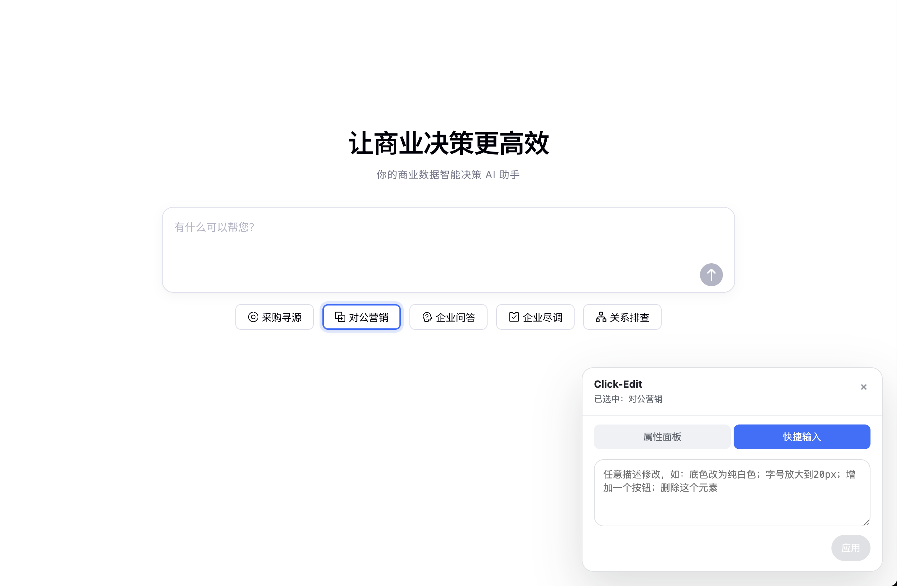
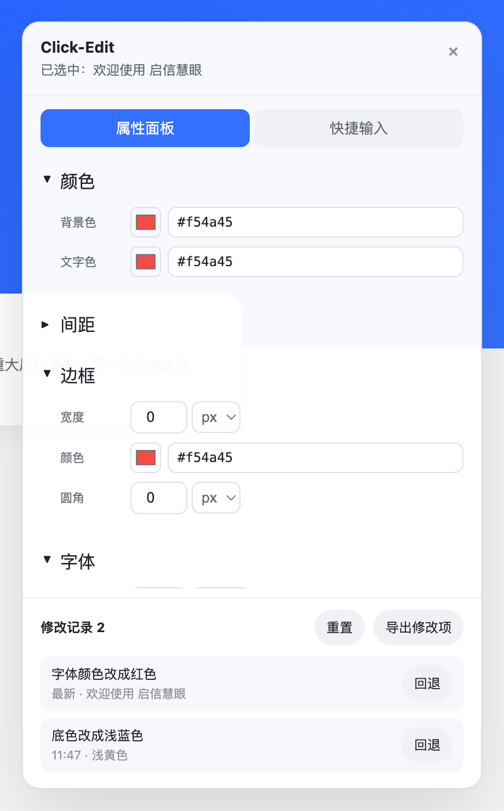
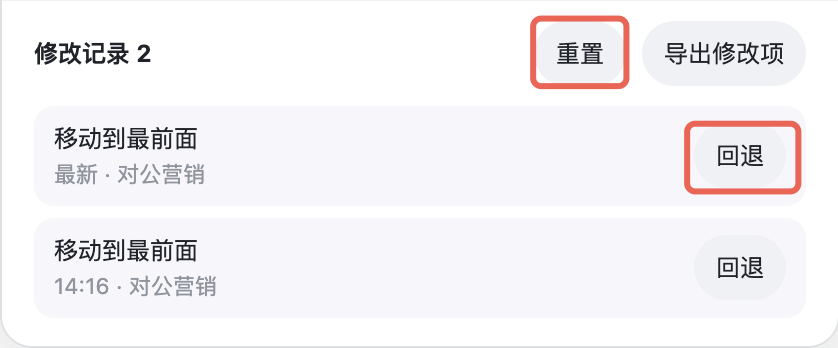

# Click-Edit 使用说明

一句话介绍：在任意网页上**点选元素 → 用属性面板或一句中文 → 即时改样式/文案**，刷新不丢，可导出修改项给开发。

适用场景：

- 评审 / 沟通时，直接在线上页面上改给对方看，不用拉前端
- 设计走查、UI 微调：颜色、间距、字号、圆角、阴影、隐藏、复制元素、调整顺序
- 改完后导出一份精确的修改清单（含 selector + 前后样式 + 元素坐标），开发对照改源码

---

## 一、安装（首次只做一次）

> 本插件**未上架 Chrome 商店**，需要用「开发者模式」加载本地文件夹。

### 1. 拿到插件文件夹

把 `extension` 这个文件夹整个拷到你电脑任意位置（推荐桌面或 `~/Documents`）。

⚠️ 注意：**不要放在 iCloud 同步目录里**，否则文件可能被云端"驱逐"导致插件加载失败。如果你拿到的是 zip，先解压。

### 2. 打开 Chrome 扩展页

地址栏粘贴：`chrome://extensions/` 回车（Edge 是 `edge://extensions/`）。


### 3. 打开开发者模式

页面**右上角**有一个「开发者模式」开关，打开它。打开后左上方会出现「加载已解压的扩展程序 / 打包扩展程序 / 更新」三个按钮：


### 4. 加载插件

点左上角「**加载已解压的扩展程序**」，选刚才那个 `extension` 文件夹（注意是文件夹本身，不是里面的 `manifest.json`）。

加载成功后会出现一个名为 **Click-Edit** 的卡片：


### 5. 固定到工具栏（推荐）

点 Chrome 右上角的拼图图标 🧩 → 找到 Click-Edit → 点旁边的图钉，把它固定到工具栏。

> 后续如果代码更新（同事重新发了一份 extension 文件夹），需要回到这个页面点 Click-Edit 卡片右下角的 🔄 **重新加载**按钮，才能让新代码生效。

---

## 二、使用

### 1. 启用编辑器

打开你想改的网页 → 点工具栏上的 Click-Edit 图标 → 点「**启用编辑器**」。


页面右下角会出现一个浮层面板：


> 同一个标签页**刷新**会自动重新启用；**新开标签页**需要再次点图标启用。

### 2. 选中元素

把鼠标移到页面上，会有蓝色虚线高亮，**点一下**就选中。选中后浮层标题下显示「已选中：xxx」，元素本身被实色蓝框圈住。



> 没有锁定模式，**点别处直接切换选中目标**。如果点中的不是你想要的那一层（比如点了文字其实想要外面的卡片），重新点一下父级区域就行。

### 3. 改样式 / 文案

面板上有两个 Tab：

#### 🅐 快捷输入（自然语言，首选）

输入框里直接打中文 → 按 **回车** 或点「应用」，例：

| 你输入                       | 效果                                       |
| ---------------------------- | ------------------------------------------ |
| `底色改为纯白色`             | background-color: #fff                     |
| `字号放大到 20px`            | font-size: 20px                            |
| `加一个磨砂半透明背景`       | 毛玻璃效果（含 backdrop-filter）           |
| `磨砂半透明，但不要阴影`     | 同上但去掉 shadow                          |
| `高度适配网页高度`           | height: 100vh                              |
| `删除阴影` / `去掉边框`      | 移除对应样式                               |
| `文案改成"立即体验"`         | 替换文本                                   |
| `删除这个元素`               | 隐藏元素                                   |
| `复制一个`                   | 在旁边克隆一个同款                         |
| `往上移` / `往下移` / `置顶` | 调整在父容器里的顺序                       |

支持的颜色关键词：蓝/绿/红/橙/紫/黑/白/灰/浅蓝/浅灰/纯白/纯黑，也可以直接写 `#1A53FF`。一句话里**可以混合多个意图**：`底色蓝色，字白色，圆角 12px`。

如果状态栏提示「未能理解指令」，先换更直接的说法（"加阴影" → "加一个柔和的阴影"），再不行就切到属性面板手改。

#### 🅑 属性面板（精确兜底）

切到「属性面板」Tab，按分组列出当前元素的可改属性，直接拖滑块/输入数值/选下拉就能改：



| 分组 | 能改什么 |
| ---- | -------- |
| **颜色** | 背景色、文字色（颜色选择器 + 16 进制输入） |
| **间距** | padding / margin 四方向 |
| **边框** | 宽度、颜色、圆角 |
| **字体** | 字号、字重（100–900）、对齐方式 |
| **尺寸** | 宽度、高度（支持 px / % / em / rem / vh / vw 单位切换） |
| **布局** | display、flex 方向、主轴/交叉轴对齐 |
| **效果** | 阴影开关、透明度、整体隐藏 |

适合两种场景：你清楚要改成什么具体数值（"圆角 12px"、"padding 24px"），或快捷输入识别不了时手动兜底。

#### 🅒 双击文字直接改

不想敲指令？**双击页面上任意一段文字**就进入富文本编辑模式，直接打字替换。回车保存，Esc 撤销。

### 4. 修改的保存机制

修改有 **3 层保留机制**，逐层升级：

| 场景 | 保留方式 | 谁能看到 |
| ---- | -------- | -------- |
| 默认 | 自动写 `localStorage` | 你自己（本浏览器+本网站） |
| 同电脑同浏览器换 tab 打开同一 URL | 自动恢复（共享 localStorage） | 你自己 |
| 给别人/开发看 | 「导出修改项」生成 Markdown 清单 | 拿到文件的人 |
| 改本地 HTML 静态文件 | 进阶：起 `save-server` 自动写回文件 | 见后文「四」 |

> 普通修改**不会**写到任何远程服务器，**只在你浏览器里**。同事打开同一个 URL 看到的还是原版。

### 5. 修改记录 / 撤销 / 回退 / 重置

面板底部展示当前页面最近 5 条修改记录：



- **回退（每条记录右侧）**：从最新记录倒序撤到这条之前。适合一连串试错后一次撤回。
- **重置**：清空当前页面所有修改并刷新页面。⚠️ 不可恢复。
- **导出修改项**：见下一节。

### 6. 导出修改项（设计走查交付）

点击面板底部的「**导出修改项**」按钮，弹出系统的「另存为」对话框，选个保存位置，会生成一份 Markdown 文件。

**文件包含：**

| 内容 | 说明 |
| ---- | ---- |
| 头部信息 | 页面标题、URL、导出时间、修改条数（区分「本次新增」和「历史已导出」） |
| 🆕 本次新增 | 上次导出之后产生的修改，开发优先看这一段 |
| ✅ 已导出过 | 之前已经导出过的修改，留作完整对照 |
| 每条修改 | CSS selector、自然语言指令、修改前/后样式对比、元素页面坐标（x/y/w/h）；如元素带 `data-ce-source` 属性会附源码路径 |
| 末尾 JSON | 完整结构化数据，可直接喂给脚本 |

**导出后你会看到：**

- 状态栏：「**保存成功**：click-edit-xxx.md（N 条修改）」—— 修改记录里这些条目会被打上「已导出」标记，下次再点导出会进入「已导出过」分组
- 如果你**点了取消**：状态栏「已取消保存。」—— 修改不会被打标记
- 如果**保存失败**：状态栏会显示具体错误

**典型流程（设计走查）：**

1. 设计师在线上页面用 Click-Edit 调整不符合设计稿的样式
2. 改完后点「导出修改项」 → 选保存位置（推荐放进项目根目录的 `_design-feedback/` 这种文件夹）
3. 把导出的 `.md` 文件发给前端开发
4. 开发用 IDE 打开，每条修改有精确 selector + 前后对比 + 坐标定位 + 自然语言原话，5 分钟改完源码

**Markdown 输出示例（节选）：**

```markdown
## 🆕 本次新增（2 条）

> 上次导出之后产生的修改，开发优先看这一段。

### 1. button.primary

> **指令**: 底色改为蓝色

- selector: `button.primary`
- 元素位置（页面坐标）: x=580, y=420, w=120, h=40

**改动**:
- background-color: `#ffffff` → `#3370ff`
```

### 7. 停用编辑器

再点一下浏览器工具栏的插件图标 → 「停用编辑器」。**已应用的修改不会被清除**（除非你点「重置」）。

---

## 三、常见问题

**Q：插件加载报错「Manifest file is missing or unreadable」**
A：确认你选的是 `extension` 文件夹本身，里面要有 `manifest.json`。如果文件夹是从 iCloud 同步过来的，可能有几个 png 还没下载下来，先把整个文件夹下到本地（图标 ☁️ 变成实心）再加载。

**Q：点了图标没反应 / 不出现编辑面板**
A：

1. 当前页是不是 `chrome://`、`chrome-extension://` 这类受限页面？这些页 Chrome 不允许任何插件注入，换一个普通 https / http 页面试。
2. 看面板状态文字，如果显示报错把文字截图发我。

**Q：刷新后样式丢了**
A：自动恢复依赖 `localStorage`，**无痕模式**或站点禁用 localStorage 时会丢。普通窗口里没事。

**Q：能改任何网站吗？**
A：能，包括公司内网、生产环境（比如 b.qixin.com）。但**改动只在你自己浏览器里**，别人看到的还是原版。

**Q：怎么把改好的样子给同事看？**

- 同电脑同浏览器：他打开同样的 URL，刷新就能看到（localStorage 共享）
- 不同电脑 / 给开发改源码：点「**导出修改项**」拿一份 Markdown，selector + 修改前后样式 + 元素坐标都在里面
- 紧急情况：截图、录屏

**Q：能直接改源代码吗？**
A：导出 Markdown 给开发是常规路径。如果是改本地 HTML 静态文件，可以走「进阶」自动写回，见下文。

**Q：插件版本更新了，怎么让 Chrome 用最新版？**
A：去 `chrome://extensions/`，点 Click-Edit 卡片右下角的 🔄 **重新加载**按钮，然后回到目标网页**刷新**。仅替换文件夹内容是不够的，必须 reload 扩展。

**Q：会不会把我的浏览数据上报出去？**
A：**不会**。当前版本不向任何外部服务器发送任何请求。所有修改都只存在你本地的浏览器 localStorage 里。

---

## 四、进阶：改本地 HTML 文件时自动写回源文件

如果你在改本地的 HTML 静态文件（地址是 `file:///...../index.html`），可以让 Click-Edit **每次应用修改后自动把整个页面 HTML 写回原文件**。

### 启动一次性 Node 服务

打开终端，进到 `extension` 目录：

```bash
cd /path/to/extension
node save-server.mjs
```

看到这行就成功了：

```
[Click-Edit Save Server] running on http://localhost:17532
```

### 使用

在浏览器里用 Click-Edit 改本地 HTML：

- 应用修改后状态栏显示「**已应用：xxx · 已写入文件**」
- 终端同步输出 `[Click-Edit] saved: /xxx/index.html`
- 文件已经被覆盖

⚠️ 这一步会**直接改源文件**，建议先 `git commit` 或备份。

> 没启动 save-server 也不影响使用——状态栏只显示「已应用：xxx」，修改保留在浏览器里（刷新仍生效）。

---

## 五、能力边界（先说在前）

- ✅ 改样式：颜色/字体/间距/圆角/阴影/隐藏/复制/排序
- ✅ 改文案：双击直接改 / 自然语言指令
- ✅ 多次改、撤销、回退到指定记录、整体重置
- ✅ 跨刷新保留（localStorage）
- ✅ 导出修改清单 Markdown 给开发
- ⚠️ **不能直接改 React/Vue 组件 props**——本质是覆盖 inline style + 改 DOM
- ⚠️ **改动只在你自己浏览器里**——别人打开同一 URL 看到的还是原版（除非也共享 localStorage）
- ⚠️ **复杂选择器可能选不中**：动态生成的 class、shadow root 内部、iframe 内部
- ⚠️ **页面有 CSP（内容安全策略）时可能注入失败**——状态栏会报错
- ⚠️ 自然语言识别**有限**——撞了识别不了的就用属性面板兜底

---

## 六、反馈

用着有问题、想加什么能力，直接找 **丁典**（dian_ding）。

期望反馈格式：

1. 哪个网站 / 哪个页面（URL）
2. 你想做什么
3. 实际发生了什么 / 截图
